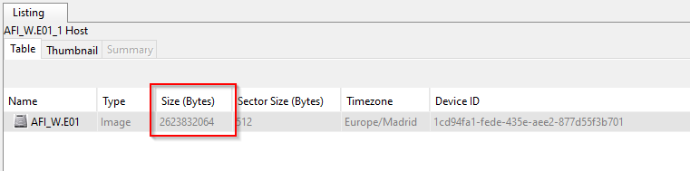
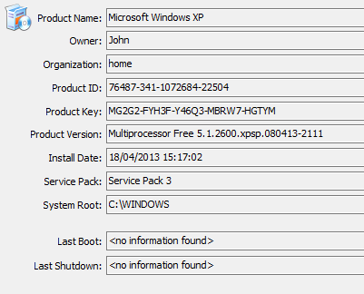
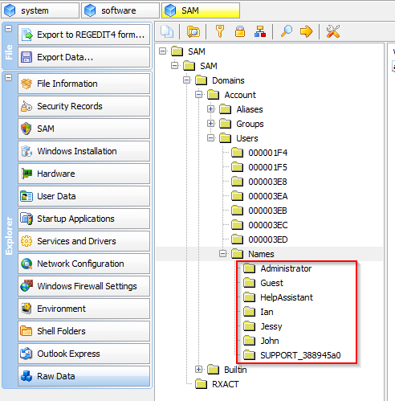
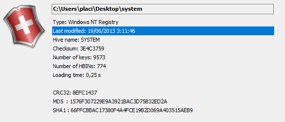

# Drug trafficking

Trabajo realizado por: Plácido Díaz Garrido

# Índice

## Describe el entorno de trabajo que has escogido para realizar la actividad.
Se utilizó un equipo con las siguientes características:
* Marca: ASUS Rog
* Modelo: 
* Procesador: 
* Memoria RAM: 16 Gb
* Sistema operativo: Windows 10 Home

## Describe, como mínimo, la información siguiente, relacionada con el sistema operativo instalado en el sistema informático que estás analizando:

### a. ¿Qué tamaño tiene la partición a analizar?

El tamaño de la unidad es de 2623832064 Bytes, es decir 2,62 Gb.

### b. Sistema y versión del sistema operativo instalado.

El sistema operativo de la máquina es un "Microsoft Windows XP".

### c. Nombre del usuario y organización registrados.

Dentro del archivo "SAM" en el apartado "Users" podemos encontrar una serie de usuarios. ejm: Ian, Jessy, John etc.

### d. “Product ID” asociado al sistema.

En el registro "SOFTWARE" encontraremos que el “Product ID” es "76487-341-1072684-22504".

### e. “Service Pack” instalado.

En el registro "SOFTWARE" podemos encontrar que la version instalada es la "Service Pack 3".

### f. Fecha y hora de instalación del sistema operativo.

En el registro "SOFTWARE" se localiza la fecha y hora de instalacion "18/04/2013 15:17:02".

### g. Fecha y hora del último “shutdown”.

En el registro "SYSTEM" podemos ver que la ultima modificacion se realizó el "19/06/2013 3:11:46".

