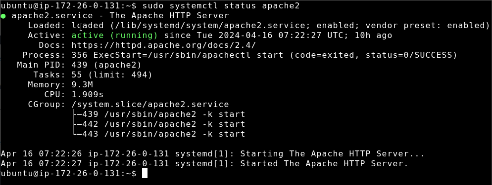

# Instalación

Instalamos el servicio apache.

Añadimos un index para comprobar que todo funciona correctamente.

Entramos en [Duck DNS](https://www.duckdns.org/domains), nos registramos y vinculamos nuestro dominio gratuito con nuesta ip.

Probamos que todo funciona, colocando el dominio en el navegador.

# Instalación del certificado

    sudo snap install --classic certbot
    
    sudo ln -s /snap/bin/certbot /usr/bin/certbot
    
    sudo certbot --apache

Una vez instalado nuestro certificado gratuito, nos pararecera un certificaado en nuestro dominio ``proyecto9.duckdns.org``

