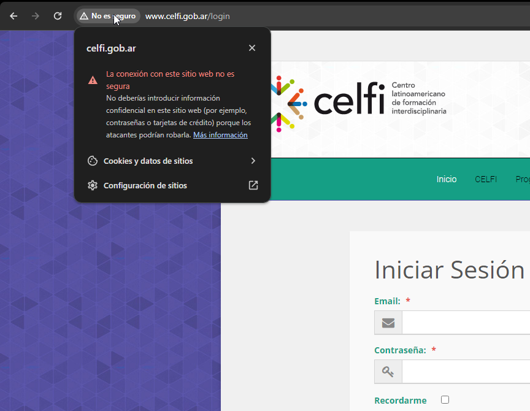

# Análisis del Certificado

Introducimos nuestro dominio en [ssllabs](https://www.ssllabs.com/ssltest/)

Los aspectos clave que llevan a considerar este certificado como válido son:

1. **Firma de un Certificado Raíz Confiado:** El certificado ha sido emitido por "R3", un emisor de certificados intermedio que a su vez es confiado por un certificado raíz ("ISRG Root X1"). Esta cadena de confianza es esencial para la validación del certificado.

2. **Algoritmo de Firma Seguro:** Se utiliza "SHA256withRSA" como algoritmo de firma, lo que es considerado seguro en el momento actual. SHA-256 es un algoritmo de hashing criptográficamente seguro, y RSA es un algoritmo de cifrado de clave pública ampliamente aceptado y utilizado.

3. **Fechas de Validez:** El certificado es válido desde el "Tue, 17 Apr 2024" hasta el "Mon, 16 Jul 2024". Esto significa que el certificado está actualmente activo y no ha expirado, lo cual es crucial para su validez.

4. **Revocation Status:** El estado de revocación es "Good (not revoked)", lo que indica que el certificado no ha sido revocado. Esto se verifica a través de la información de revocación proporcionada por el emisor, en este caso mediante OCSP (Online Certificate Status Protocol).

5. **Tamaño de Clave y Tipo:** El certificado utiliza una clave EC de 256 bits. La criptografía de curva elíptica (ECC) es conocida por ofrecer una alta seguridad con claves más cortas en comparación con RSA, lo que hace que las claves de 256 bits sean suficientemente seguras.

# Localiza y Analiza tres certificados 

## Certificado 1

He accedido al login del [Ministerio de Ciencia de Argentina](http://www.celfi.gob.ar/login)

Este fallo merece atención especial, puesto que surge al tratar de acceder a un sitio web y se carga su versión no cifrada, es decir, la HTTP. Es crucial reconocer que los sitios seguros emplean HTTPS, pues en caso contrario, nos exponemos a posibles ataques y a que nuestros datos transmitidos sean interceptados.

En aras de la seguridad, el navegador emite esta alerta para notificar que no ha sido posible cargar el certificado SSL. Nos advierte que continuar navegando bajo estas condiciones podría comprometer nuestra información, con el riesgo de que caiga en manos indebidas.

## Certificado 2

Este problema puede presentarse por dos razones principales: una modificación en la configuración de nuestro navegador o un error en la configuración de los protocolos de cifrado del servidor remoto.

Para resolver esta situación, lo más aconsejable es comunicarse con el administrador del sitio web para asegurarse de que sus protocolos de cifrado estén configurados correctamente. Desde nuestro lado, tenemos la opción de revisar y ajustar la configuración del navegador o, si es necesario, restablecerla a sus valores predeterminados.

## Certificado 3

También puede surgir el error ERR_TOO_MANY_REDIRECTS, que se presenta cuando la página a la que intentamos acceder inicia múltiples redirecciones hacia otros sitios. Esto resulta en un ciclo sin fin, impidiendo que la página se cargue correctamente.

Afortunadamente, este problema suele tener una solución bastante simple en la mayoría de los casos. Limpiar las cookies y los archivos temporales del navegador suele ser suficiente. En el caso de Chrome, esto se puede hacer accediendo al menú situado en la esquina superior derecha (el ícono de tres puntos), luego yendo a Configuración, dentro de Seguridad y privacidad, seleccionamos Borrar datos de navegación, y ahí elegimos eliminar cookies y archivos temporales.
