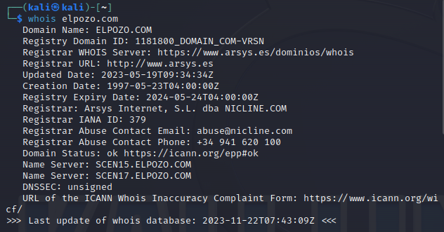
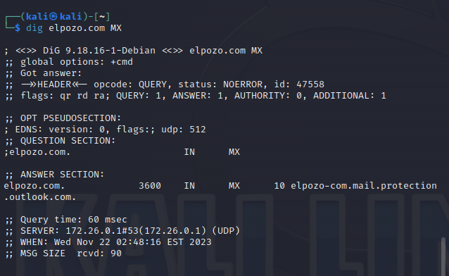
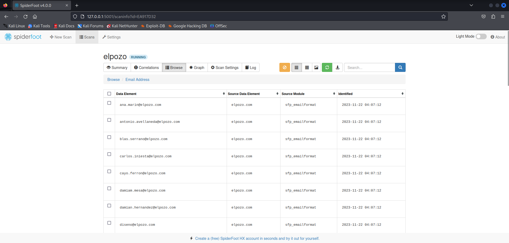
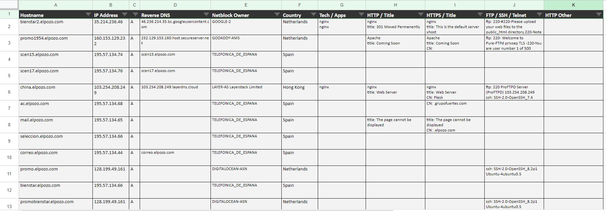

# Auditoría OSINT para "El POZO"

## 1. Información Whois
- **Herramienta Usada**: Whois.
- **Proceso**: 
  
  Se ha realizado una consulta Whois para obtener información sobre el dominio de "El POZO".
  


- **Información relevante:** 

  Incluye datos de registro, direcciones IP, información del ISP y detalles del contacto administrativo.

````
  $ whois elpozo.com
      Domain Name: ELPOZO.COM
      Registry Domain ID: 1181800_DOMAIN_COM-VRSN
      Registrar WHOIS Server: https://www.arsys.es/dominios/whois
      Registrar URL: http://www.arsys.es
      Updated Date: 2023-05-19T09:34:34Z
      Creation Date: 1997-05-23T04:00:00Z
      Registry Expiry Date: 2024-05-24T04:00:00Z
      Registrar: Arsys Internet, S.L. dba NICLINE.COM
      Registrar IANA ID: 379
      Registrar Abuse Contact Email: abuse@nicline.com
      Registrar Abuse Contact Phone: +34 941 620 100
      Domain Status: ok https://icann.org/epp#ok
      Name Server: SCEN15.ELPOZO.COM
      Name Server: SCEN17.ELPOZO.COM
      DNSSEC: unsigned
   URL of the ICANN Whois Inaccuracy Complaint Form: https://www.icann.org/wicf/
>>> Last update of whois database: 2023-11-22T10:39:21Z <<<

````

## 2. Servidores DNS
- **Herramienta Usada**: DNSdumpster.
- **Proceso**: 
  
  Se ha utilizado **DNSdumpster** para identificar los servidores DNS que utiliza "el pozo" .


- **Información relevante:** 


## 3. Servidores de Correo
- **Herramienta Usada**: MXToolBox, DNSlytics, Email Verifier.
- **Proceso**: 
  - Importante para entender la infraestructura de comunicaciones de "El POZO".

  Usando el comando **dig**, se ha investigado los registros MX para determinar los servidores de correo electrónico de la empresa. :



  Utilizando **spiderfoot**, podemos ver los correos de los trabajadores:



- **Información relevante:** 


## 4. Subdominios
- **Herramienta Usada**: DNSdumpster.
- **Proceso**: 
  - Busca subdominios asociados al dominio principal.
  - Revela aspectos adicionales de la infraestructura de la red y posibles puntos de entrada.




## 5. Información Adicional
- **Redes Sociales y Presencia Online**: 
  
  En la pagina principal de ["elpozo.com"](https://www.elpozo.com/) hay enlaces a sus redes sociales. Estas son las que nos muestran:
  - [Facebook](https://www.facebook.com/ElPozoAlimentacion/timeline/)
  - [Instagram](https://www.instagram.com/elpozoalimentacion/)
  - [Twitter](https://twitter.com/ElPozoAlimenta)
  - [Youtube](https://www.youtube.com/c/ElPozoAlimentaci%C3%B3nvideos)

- **Información de Empleados**: 

    Al realizar una busqueda en linkedin podemos encontrar los puestos de algunos de sus trabajadores e información importante.

## Justificación de la Relevancia
- Cada pieza de información ofrece una visión de la infraestructura y operaciones de "El POZO".
- Los servidores DNS y de correo pueden revelar vulnerabilidades potenciales o puntos de contacto clave.
- Los subdominios pueden indicar diferentes áreas de la empresa.
- La información Whois proporciona detalles legales y técnicos.
