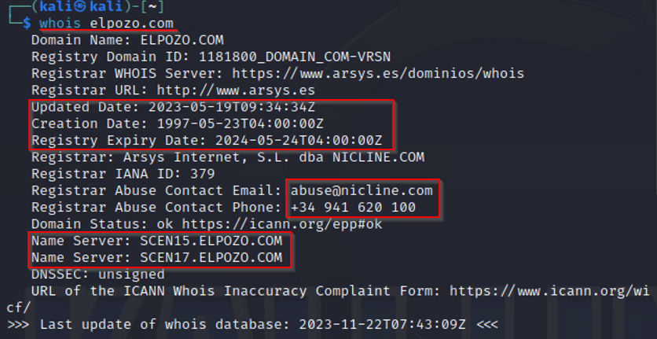
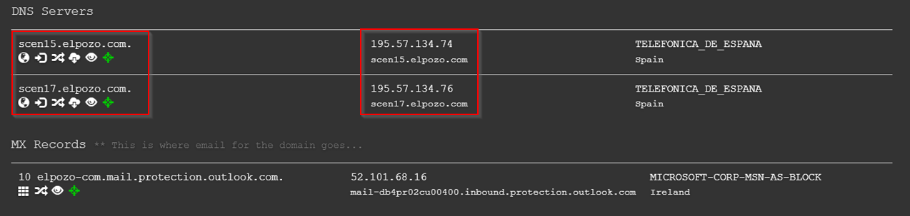
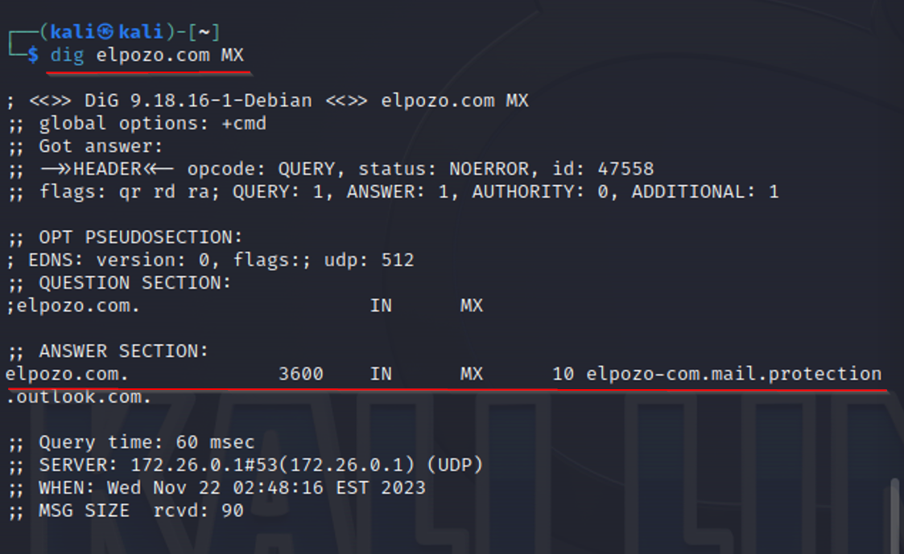
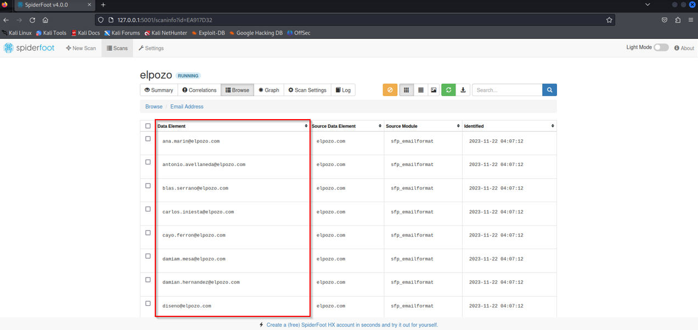
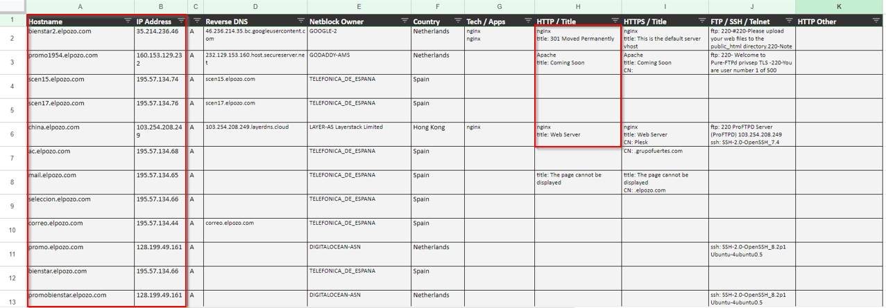
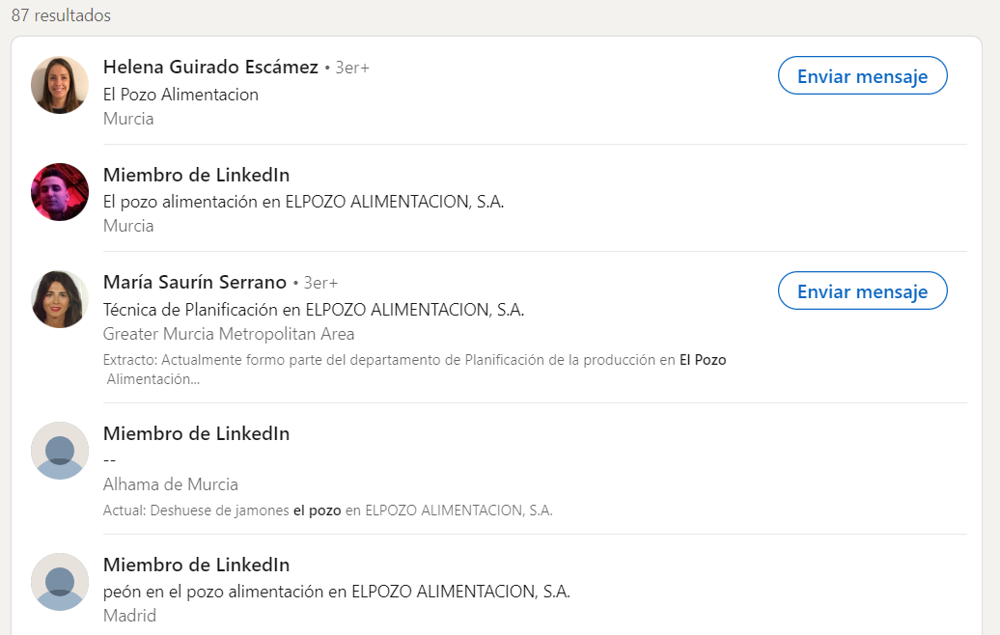

# Auditoría OSINT para "El POZO"


# Índice

- [Introducción](#Introducción)
- [1. Información Whois](#Información-Whois)
- [2. Servidores DNS](#Servidores-DNS)
- [3. Servidores de Correo](#Servidores-de-Correo)
- [4. Subdominios](#Subdominios)
- [5. Información Adicional](#Información-Adicional)

## Introducción
En este trabajo se muestra un análisis profundo de la empresa "El POZO", empleando diversas herramientas de seguridad informática. Se muestran la información obtenida y la forma. El método utilizado para la recopilación y análisis de datos se detalla, resaltando técnicas específicas de ciberseguridad.

## 1. Información Whois
- **Herramienta Usada**: Whois.
- **Proceso**: 
  
  Se ha realizado una consulta Whois para obtener información sobre el dominio de "El POZO".
  


- **Información relevante:** 

  Se han obtenido datos de registro:
  ``````
  Registry Domain ID: 1181800_DOMAIN_COM-VRSN
  Registry Expiry Date: 2024-05-24T04:00:00Z
  Updated Date: 2023-05-19T09:34:34Z
  Creation Date: 1997-05-23T04:00:00Z
  ``````
  Utilizando **Whois Online**, podemos obtener la direcciones IP de la web:
  ``````
  195.57.134.66
  ``````
  Información del ISP;
  ``````
  Registrar URL: http://www.arsys.es
  Registrar: Arsys Internet, S.L. dba NICLINE.COM
  Registrar IANA ID: 379
  ``````
  Detalles del contacto administrativo:
  ``````
  Registrar Abuse Contact Email: abuse@nicline.com
  Registrar Abuse Contact Phone: +34 941 620 100
  ``````
  Servidores DNS
  ``````
  Name Server: SCEN15.ELPOZO.COM
  Name Server: SCEN17.ELPOZO.COM
  ``````

## 2. Servidores DNS
- **Herramienta Usada**: DNSdumpster.
- **Proceso**: 
  
  Se ha utilizado **DNSdumpster** para identificar los servidores DNS que se utilizan, sus direcciones ip y alguna información extra.



- **Información relevante:** 

  ``````
  scen15.elpozo.com -> 195.57.134.74

  scen17.elpozo.com -> 195.57.134.76
  ``````


## 3. Servidores de Correo
- **Herramientas Usadas**: Dig, spiderfoot.
- **Proceso**: 

  Usando el comando **dig**, se ha investigado los registros MX para determinar los servidores de correo electrónico de la empresa:



  Utilizando **spiderfoot**, podemos ver los correos de los trabajadores:



- **Servidor de correo detectado:** 

  ``````
  elpozo.com -> elpozo-com.mail.protection
  ``````

## 4. Subdominios
- **Herramienta Usada**: DNSdumpster.
- **Proceso**: 
  
  Se ha utilizado **DNSdumpster** para busca subdominios asociados al dominio principal. Esta página nos devuelve un fichero ".xlsx" con todos los subdominios de de la empresa.



- **Información relevante:** 

  Aqui podemos encontrar tanto el HostName, sus ips, el propietario de cada subdominio y le tecnología utilizada en cada uno. 

## 5. Información Adicional
- **Redes Sociales y Presencia Online**: 
  
  En la pagina principal de ["elpozo.com"](https://www.elpozo.com/) hay enlaces a sus redes sociales. Estas son las que nos muestran:
  - [Facebook](https://www.facebook.com/ElPozoAlimentacion/timeline/)
  - [Instagram](https://www.instagram.com/elpozoalimentacion/)
  - [Twitter](https://twitter.com/ElPozoAlimenta)
  - [Youtube](https://www.youtube.com/c/ElPozoAlimentaci%C3%B3nvideos)

- **Información de Empleados**: 

    Al realizar una busqueda en linkedin podemos encontrar los puestos de algunos de sus trabajadores e información importante. 




- **Personas relevantes en la empresa**:
  - [Laura Sánchez Acosta - RRHH](https://www.linkedin.com/in/laura-s%C3%A1nchez-acosta-2408/)
  - [Jorge Luis Villalobos Pernalette - Responsable de ventas](https://www.linkedin.com/in/jorge-luis-villalobos-pernalette-880199ab/)
  - [Jose Luis Suarez Acosta - Jefe de Ventas](https://www.linkedin.com/in/jose-luis-suarez-acosta-471164b1/)
