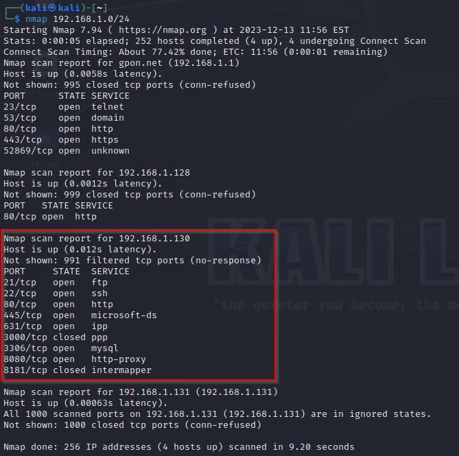
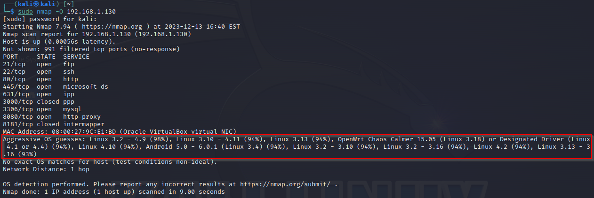
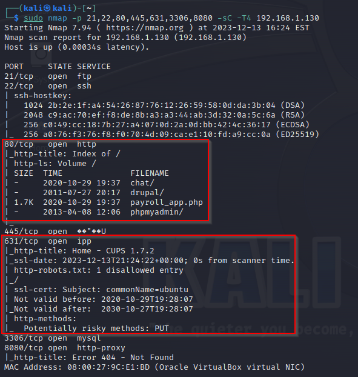
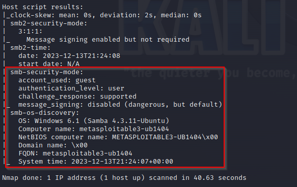
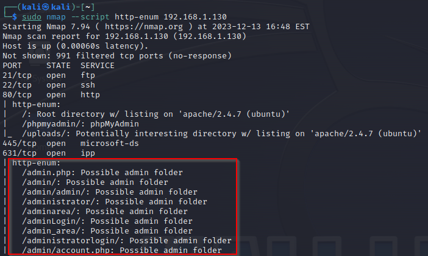
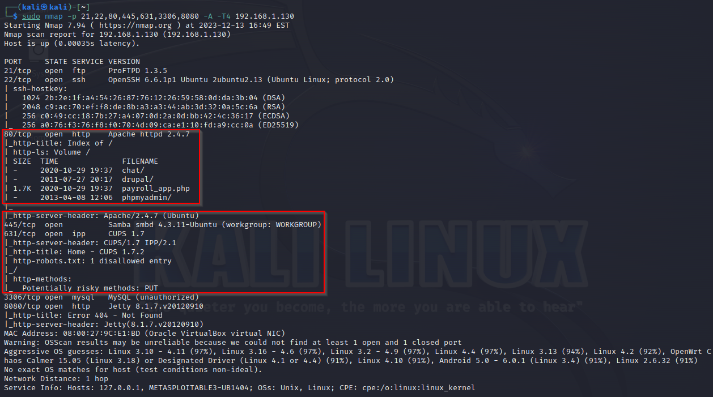
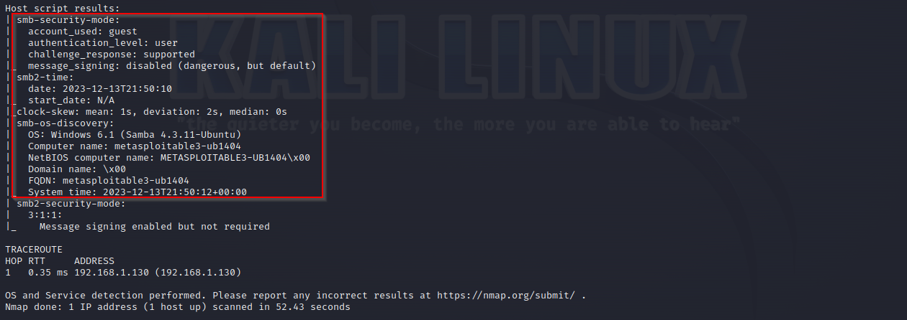

# Auditoría a Metasploitable3 Utilizando Nmap

Trabajo realizado por Plácido Díaz

## Índice
1. [Identificación de la IP del Equipo Objetivo](#a-identificación-de-la-ip-del-equipo-objetivo)
2. [Identificación del Sistema Operativo](#b-identificación-del-sistema-operativo)
3. [Identificación de Puertos/Servicios Abiertos (TCP / UDP)](#c-identificación-de-puertosservicios-abiertos-tcp--udp)
4. [Identificación de Versiones de Servicios](#d-identificación-de-versiones-de-servicios)
5. [Usuarios con Contraseñas Vacías (NSE)](#e-usuarios-con-contraseñas-vacías-nse)
6. [Vulnerabilidades en el Equipo (NSE)](#f-vulnerabilidades-en-el-equipo-nse)
7. [Servicios Web Habilitados (NSE)](#g-servicios-web-habilitados-nse)
8. [Scripts por Defecto de Nmap (NSE)](#h-scripts-por-defecto-de-nmap-nse)

## a) Identificación de la IP del Equipo Objetivo
Para descubrir la ip de la máquina podemos usar nmap para escanear todas las direcciones de red que deseemos. Usaremos el comando **`nmap 192.168.1.0/24`**, lo que escanearía todas las direcciones IP en el rango 192.168.1.1 a 192.168.1.255. En la siguiente imagen podemos ver que la ip **"192.168.1.130"** es la máquina deseada.

## b) Identificación del Sistema Operativo
Ejecutamos `sudo nmap -O 192.168.1.130` para identificar el posible Sistema Operativo de la máquina. Podemos ver con porcentaje la probabilidad de que sea el sistema indicado.

## c) Identificación de Puertos/Servicios Abiertos (TCP / UDP)
Ejecutando el comando `sudo nmap -sS 192.168.1.130` podremos ver los puertos y servicios usados. Podemos ver que existen servicios de ftp, ssh, http, ipp, mysql y http-proxy activos y sus respectivos puertos.

## d) Identificación de Versiones de Servicios
Ejecutando el comando `sudo nmap -sV 192.168.1.130` podremos ver la version de los servicios.

## e) Usuarios con Contraseñas Vacías (NSE)
Ejecutando el comando `sudo nmap --script auth 192.168.1.130` podremos ver los usuarios del sistema. Encontramos 2 usuarios: chewbacca y nobody.

Ejecutando el comando `sudo nmap -p 21,22,80,445,631,3306,8080 --script ssh-auth-methods --script-args ssh.user=chewbacca 192.168.1.130` podremos ver si el usuario tiene contraseña ssh.
- **--script ssh-auth-methods:** Utiliza un script de nmap para determinar los métodos de autenticación permitidos por un servidor SSH. Esto se utiliza para identificar cómo un servidor SSH está configurado en términos de autenticación.

- **--script-args ssh.user=chewbacca:** Proporciona argumentos para el script. En este caso, especifica el nombre de usuario chewbacca para ser utilizado por el script ssh-auth-methods.

En la imagen se nos muestra que ambos usuarios se pueden identificar mediante una clave publica o una contraseña.

## f) Vulnerabilidades en el Equipo (NSE)
Ejecutando el comando `sudo nmap -p 21,22,80,445,631,3306,8080 -sC -T4 192.168.1.130` podemos buscar vulnerabilidades en los puertos seleccionados.

- **-sC:** Esta opción ejecuta scripts predeterminados que vienen con nmap. Estos scripts están diseñados para realizar una variedad de escaneos y chequeos automáticos, como detección de versiones de servicios, vulnerabilidades conocidas, etc.

En las imagenes podemos ver rutas de http, ipp y datos de samba relevantes.

## g) Servicios Web Habilitados (NSE)
Ejecutando el comando `sudo nmap --script http-enum 192.168.1.130` podemos ver los posibles directorios http que existen.

- **--script=http-enum:** Este script enumerar los caminos de directorios en un servidor web al probar un conjunto de rutas comunes. Es útil para descubrir contenido y funcionalidades ocultas en los servicios web.

## h) Scripts por Defecto de Nmap (NSE)
Ejecutando el comando `sudo nmap -p 21,22,80,445,631,3306,8080 -A -T4 192.168.1.130` podemos ejecutar diferentes funciones al mismo tiempo.

- **-A:** Esta opción activa el escaneo avanzado. Incluye detección de sistema operativo, versión de servicios, ejecución de scripts Nmap y detección de traceroute.

En las imagenes podemos ver archivos de http, ipp y datos de samba relevantes.

