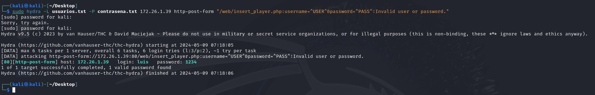
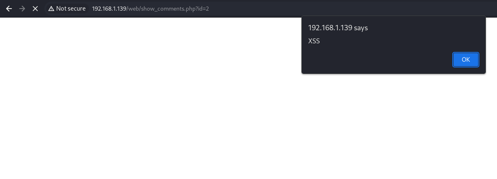
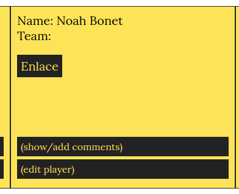

# Preguntas Planteadas

# Parte 1 - SQLi

## a) Dad un ejemplo de combinación de usuario y contraseña que provoque un error en la consulta SQL generada por este formulario. Apartir del mensaje de error obtenido, decid cuál es la consulta SQL que se ejecuta, cuál de los campos introducidos al formulario utiliza y cuál no.

Si escribo **"** en el campo usuario del formulario de la página ``/web/insert_player.php``. La consulta SQL que se ejecuta nos devuelve el siguiente error ``Invalid query: SELECT userId, password FROM users WHERE username = """. Field user introduced is: "``.

En la consulta solo se usa el campo username.

## b) Gracias a la SQL Injection del apartado anterior, sabemos que este formulario es vulnerable y conocemos el nombre de los campos de la tabla “users”. Para tratar de impersonar a un usuario, nos hemos descargado un diccionario que contiene algunas de las contraseñas más utilizadas (se listan a continuación):

- password
- 123456
- 12345678
- 1234
- qwerty
- 12345678
- dragon

## Dad un ataque que, utilizando este diccionario, nos permita impersonar un usuario de esta aplicación y acceder en nombre suyo. Tened en cuenta que no sabéis ni cuántos usuarios hay registrados en la aplicación, ni los nombres de estos.

El ataque consiste en repetir una serie de intentos de inicio de sesión utilizando en cada iteración una contraseña diferente del diccionario proporcionado. Cada intento intentará combinar un nombre de usuario de una lista potencial de nombres de usuario (normalmente recogida en un archivo de texto como usuarios.txt) con cada contraseña del diccionario (en un archivo como contrasenas.txt). 

    sudo hydra -L usuarios.txt -P contrasena.txt 172.26.1.39 http-post-form "/web/insert_player.php:username=^USER^&password=^PASS^:Invalid user or password."

## c) Si vais a private/auth.php, veréis que en la función areUserAndPasswordValid”, se utiliza “SQLite3::escapeString()”, pero, aun así, el formulario es vulnerable a SQL Injections, explicad cuál es el error de programación de esta función y como lo podéis corregir.

El error en la función `areUserAndPasswordValid` del archivo `auth.php` se debe al uso inadecuado de la función `SQLite3::escapeString()`. Esta función se usa incorrectamente para escapar toda una consulta SQL, lo que debería hacerse solo sobre los valores individuales que se insertan en la consulta. 

El problema con este enfoque es que SQLite3::escapeString() se aplica a la consulta completa, incluyendo la sintaxis SQL junto con la entrada del usuario, en lugar de aplicarse únicamente a las entradas de usuario. Esto no previene eficazmente las inyecciones SQL porque un atacante podría aún manipular el resultado final de la consulta escapando del contexto de la cadena de texto.

Para corregir esta vulnerabilidad y asegurar la seguridad de la aplicación, se debe cambiar el uso de SQLite3::escapeString() por el uso de consultas preparadas con parámetros vinculados. Esta práctica es la recomendada para prevenir inyecciones SQL ya que separa claramente los datos de las instrucciones SQL. Aquí está el cambio sugerido:

#### Cambiar la línea:

    $query = SQLite3::escapeString('SELECT userId, password FROM users WHERE username = "' . $user . '"');

#### Por la siguiente línea:

    $stmt = $db->prepare('SELECT userId, password FROM users WHERE username = ?');
    $stmt->bindValue(1, $user, SQLITE3_TEXT);
    $result = $stmt->execute();
    $row = $result->fetchArray();
    
Esta modificación utiliza consultas preparadas y parámetros vinculados para manejar de manera segura la entrada del usuario, evitando que los valores de entrada puedan alterar la lógica SQL. Además, esta técnica garantiza que cualquier entrada del usuario se maneje como un literal de cadena en lugar de como parte ejecutable de la consulta.

## d) Esto os permite estudiar el código fuente de “add_comment.php” y encontrar una vulnerabilidad para publicar mensajes en nombre de otros usuarios. ¿Cuál es esta vulnerabilidad, y cómo es el ataque que utilizáis para explotarla?

**Vulnerabilidad detectada:** Se detectó una inyección de SQL a través de la manipulación de los valores de las cookies y los parámetros GET utilizados en la consulta SQL. La lógica del script acepta los valores **$_GET['id']** y **$_COOKIE['userId']** directamente sin realizar una validación adecuada o saneamiento más allá del cuerpo del mensaje (que utiliza **SQLite3::escapeString** para el campo **body** solamente).

**Descripción del ataque:** Un atacante puede interceptar y modificar la cookie **userId** para inyectar SQL y potencialmente alterar la consulta SQL ejecutada. Esto podría permitir al atacante insertar comentarios en nombre de otros usuarios o incluso ejecutar acciones más maliciosas como borrar la base de datos o acceder a información sensible. Un ejemplo de ataque sería modificar la cookie **userId** para algo como `'1'; DROP TABLE comments; --`. Esto haría que la consulta final sea malformada y ejecutara el comando DROP, eliminando la tabla de comentarios.

**Cómo podemos hacer que sea segura esta entrada:**

- **Validación Estricta:** Asegurar de que tanto **$_GET['id']** como **$_COOKIE['userId']** sean validados estrictamente para coincidir con un patrón esperado, como ser numéricos, antes de usarlos en cualquier consulta SQL.

- **Uso de sentencias preparadas:** En lugar de concatenar directamente los valores en la consulta SQL, utiliza sentencias preparadas. Esto asegura que los valores se traten como datos y no como parte del código SQL, eliminando el riesgo de inyección de SQL.

- **Saneamiento de Entradas:** Aunque **$_POST['body']** se está saneando, todos los otros parámetros también deben ser saneados utilizando métodos adecuados dependiendo del tipo de dato esperado y el contexto en que se usen.

- **Cookies Seguras:** Implementar medidas adicionales para asegurar que las cookies no puedan ser fácilmente manipuladas o interceptadas, como usar cookies seguras (secure), HttpOnly y considerar la implementación de tokens de autenticación que sean difíciles de replicar o adivinar.

# Parte 2 - XSS

## a) Para ver si hay un problema de XSS, crearemos un comentario que muestre un alert de Javascript siempre que alguien consulte el/los comentarios de aquel jugador (show_comments.php). Dad un mensaje que genere un «alert»de Javascript al consultar el listado de mensajes.

    

## b) Por qué dice "&" cuando miráis un link(como elque aparece a la portada de esta aplicación pidiendo que realices un donativo) con parámetros GETdentro de código html si en realidad el link es sólo con "&" ?

El &amp; garantiza que el navegador entienda que & es parte del URL y no el inicio de una entidad HTML. Esto es crucial para que el servidor que recibe la petición GET interprete correctamente los diferentes parámetros (amount y destination en este caso).

## c) Explicad cuál es el problema de show_comments.php, y cómo lo arreglaríais. Para resolver este apartado, podéis mirar el código fuente de esta página.

#### ¿Cuál es el problema?

El problema principal en el código dado es que utiliza directamente la entrada del usuario ($_GET['id']) en la consulta SQL sin sanearla o prepararla, lo cual lo hace vulnerable a ataques de inyección SQL y XSS. Esto puede permitir a un atacante manipular la consulta SQL para obtener datos no autorizados o causar otros daños.

#### Sustituimos el código...

    $query = "SELECT commentId, username, body FROM comments C, users U WHERE C.playerId =".$_GET['id']." AND U.userId = C.userId order by C.playerId desc";

#### ...por el siguiente código:

    if (isset($_GET['id'])) {
        $playerId = intval($_GET['id']); // Convertimos la entrada a un entero para mayor seguridad
        $stmt = $db->prepare("SELECT commentId, username, body FROM comments C JOIN users U ON U.userId = C.userId WHERE C.playerId = ? ORDER BY C.playerId DESC");
        $stmt->bind_param('i', $playerId); // 'i' indica que la variable es de tipo entero
        $stmt->execute();
        $result = $stmt->get_result();
        while ($row = $result->fetch_assoc()) {
            echo "

                    <h4> ". htmlspecialchars($row['username']) ."</h4> 
                    
commented: " . htmlspecialchars($row['body']) . "

                  
";
        }
    }

En este código mejorado, se utiliza intval() para asegurarse de que el playerId es un entero, y se emplean consultas preparadas con bind_param para prevenir inyecciones SQL. Además, usamos htmlspecialchars al imprimir el username y el cuerpo del comentario para prevenir posibles ataques XSS (Cross-Site Scripting).

## d) Descubrid si hay alguna otra página que esté afectada por esta misma vulnerabilidad. En caso positivo, explicad cómo lo habéis descubierto.

En `insert_player.php?id=` podemos ver como el campo id no está sanitizado por lo que podriamos realizar una injección de código. Anteriormente pudimos ver como el campo id no se estaba valiando por lo que se ha probado meter un alert.

# Parte 3 - Control de acceso, autenticación y sesiones de usuarios

## a) En el ejercicio 1, hemos visto cómo era inseguro el acceso de los usuarios a la aplicación. En la página de register.php tenemos el registro de usuario. ¿Qué medidas debemos implementar para evitar que el registro sea inseguro? Justifica esas medidas e implementa las medidas que sean factibles en este proyecto.

**1. Validación de Entradas**
Al igual que en el registro, es crucial validar todas las entradas en el login para prevenir inyecciones SQL y otros ataques de entrada. Asegúrate de que los nombres de usuario y contraseñas no contengan caracteres no permitidos.

**2. Autenticación Segura**
Utiliza funciones de comparación de contraseñas seguras como password_verify() para comparar el hash de la contraseña ingresada con el hash almacenado en la base de datos. Esto evita vulnerabilidades relacionadas con el manejo inseguro de contraseñas.

**3. Consultas Preparadas**
Implementa consultas preparadas para todas las interacciones con la base de datos, evitando así ataques de inyección SQL durante el proceso de login.

**4. Uso de Sesiones Seguras**
Asegúrate de que las sesiones sean seguras utilizando cookies seguras (flags Secure y HttpOnly) y regenerando el ID de sesión al momento del login para evitar ataques de sesión fijada.

#### Código Corregido

        require_once dirname(__FILE__) . '/private/conf.php';
        session_start();
    
        if (isset($_POST['username']) && isset($_POST['password'])) {
            $username = $_POST['username'];
            $password = $_POST['password'];
    
            // Validación de la entrada
            $username = filter_var($username, FILTER_SANITIZE_STRING);
            $password = filter_var($password, FILTER_SANITIZE_STRING);
        
            // Uso de consultas preparadas para verificar los datos
            $stmt = $db->prepare("SELECT password FROM users WHERE username = ?");
            $stmt->bind_param("s", $username);
            $stmt->execute();
            $result = $stmt->get_result();
            if ($result->num_rows > 0) {
                $user = $result->fetch_assoc();
                if (password_verify($password, $user['password'])) {
                    // Autenticación exitosa
                    $_SESSION['user_id'] = $user['id'];
                    header("Location: list_players.php");
                } else {
                    // Autenticación fallida
                    echo "Username or password is incorrect.";
                }
            } else {
                echo "Username or password is incorrect.";
            }
        }

## b) En el apartado de login de la aplicación, también deberíamos implantar una serie de medidas para que sea seguro el acceso, (sin contar la del ejercicio 1.c). Como en el ejercicio anterior, justifica esas medidas e implementa las que sean factibles y necesarias (ten en cuenta las acciones realizadas en el register). Puedes mirar en la carpeta private

**1. Validación de Entradas**
Es importante validar todas las entradas que los usuarios pueden proporcionar. Esto incluye verificar que los usernames no contengan caracteres especiales que puedan ser utilizados en ataques de inyección SQL y que las contraseñas cumplan con ciertos estándares de seguridad (longitud, caracteres especiales, etc.).

**2. Hashing de Contraseñas**
Nunca debes almacenar contraseñas en texto plano. Utiliza una función de hashing robusta como password_hash() en PHP para almacenar contraseñas de manera segura.

**3. Uso de Consultas Preparadas**
Para proteger tu base de datos de ataques de inyección SQL, utiliza consultas preparadas con PDO o mysqli en lugar de concatenar directamente los inputs en tus consultas SQL.

#### Código Corregido

    if (isset($_POST['username']) && isset($_POST['password'])) {
        $username = $_POST['username'];
        $password = $_POST['password'];
    
        // Validación de la entrada
        $username = filter_var($username, FILTER_SANITIZE_STRING);
        $password = filter_var($password, FILTER_SANITIZE_STRING);
    
        // Hashing de la contraseña
        $passwordHash = password_hash($password, PASSWORD_DEFAULT);
    
        // Uso de consultas preparadas para insertar los datos
        $stmt = $db->prepare("INSERT INTO users (username, password) VALUES (?, ?)");
        $stmt->bind_param("ss", $username, $passwordHash);
        $stmt->execute();
    
        header("Location: list_players.php");
    }

## c) Volvemos a la página de register.php, vemos que está accesible para cualquier usuario, registrado o sin registrar. Al ser una aplicación en la cual no debería dejar a los usuarios registrarse, qué medidas podríamos tomar para poder gestionarlo e implementa las medidas que sean factibles en este proyecto.

**1. Uso de Autenticación Administrativa**
Limita el acceso a la página de registro solo a usuarios que tengan roles administrativos. Esto significa que un usuario debe estar logueado y además tener el rol adecuado para poder acceder a la página.

**2. Configuración en el Servidor**
Puedes configurar el servidor para restringir el acceso a register.php directamente desde la configuración del servidor web, como Apache o Nginx, utilizando reglas en el .htaccess o en los archivos de configuración del servidor.

**3. Modificación del Código para Verificar Permisos**
Modifica el código para incluir una verificación de permisos justo al comienzo del archivo register.php. Si el usuario no cumple con los requisitos (por ejemplo, no está logueado o no es administrador), entonces se le puede redirigir a otra página o mostrar un mensaje de error.

#### Código Sugerido

    <?php
    require_once dirname(__FILE__) . '/private/conf.php';
    require_once dirname(__FILE__) . '/private/auth.php';
    
    // Simulamos la verificación de que el usuario es administrador
    $isAdmin = $_SESSION['user_role'] === 'admin';
    
    if (!$isAdmin) {
        // Si no es administrador, redirige a la página de inicio de sesión o muestra un mensaje
        header("Location: login.php");
        exit();
    }# Parte 3 - Control de acceso, autenticación y sesiones de usuarios

## a) En el ejercicio 1, hemos visto cómo era inseguro el acceso de los usuarios a la aplicación. En la página de register.php tenemos el registro de usuario. ¿Qué medidas debemos implementar para evitar que el registro sea inseguro? Justifica esas medidas e implementa las medidas que sean factibles en este proyecto.

**1. Validación de Entradas**
Al igual que en el registro, es crucial validar todas las entradas en el login para prevenir inyecciones SQL y otros ataques de entrada. Asegúrate de que los nombres de usuario y contraseñas no contengan caracteres no permitidos.

**2. Autenticación Segura**
Utiliza funciones de comparación de contraseñas seguras como password_verify() para comparar el hash de la contraseña ingresada con el hash almacenado en la base de datos. Esto evita vulnerabilidades relacionadas con el manejo inseguro de contraseñas.

**3. Consultas Preparadas**
Implementa consultas preparadas para todas las interacciones con la base de datos, evitando así ataques de inyección SQL durante el proceso de login.

**4. Uso de Sesiones Seguras**
Asegúrate de que las sesiones sean seguras utilizando cookies seguras (flags Secure y HttpOnly) y regenerando el ID de sesión al momento del login para evitar ataques de sesión fijada.

#### Código Corregido

        require_once dirname(__FILE__) . '/private/conf.php';
        session_start();
    
        if (isset($_POST['username']) && isset($_POST['password'])) {
            $username = $_POST['username'];
            $password = $_POST['password'];
    
            // Validación de la entrada
            $username = filter_var($username, FILTER_SANITIZE_STRING);
            $password = filter_var($password, FILTER_SANITIZE_STRING);
        
            // Uso de consultas preparadas para verificar los datos
            $stmt = $db->prepare("SELECT password FROM users WHERE username = ?");
            $stmt->bind_param("s", $username);
            $stmt->execute();
            $result = $stmt->get_result();
            if ($result->num_rows > 0) {
                $user = $result->fetch_assoc();
                if (password_verify($password, $user['password'])) {
                    // Autenticación exitosa
                    $_SESSION['user_id'] = $user['id'];
                    header("Location: list_players.php");
                } else {
                    // Autenticación fallida
                    echo "Username or password is incorrect.";
                }
            } else {
                echo "Username or password is incorrect.";
            }
        }

## b) En el apartado de login de la aplicación, también deberíamos implantar una serie de medidas para que sea seguro el acceso, (sin contar la del ejercicio 1.c). Como en el ejercicio anterior, justifica esas medidas e implementa las que sean factibles y necesarias (ten en cuenta las acciones realizadas en el register). Puedes mirar en la carpeta private

**1. Validación de Entradas**
Es importante validar todas las entradas que los usuarios pueden proporcionar. Esto incluye verificar que los usernames no contengan caracteres especiales que puedan ser utilizados en ataques de inyección SQL y que las contraseñas cumplan con ciertos estándares de seguridad (longitud, caracteres especiales, etc.).

**2. Hashing de Contraseñas**
Nunca debes almacenar contraseñas en texto plano. Utiliza una función de hashing robusta como password_hash() en PHP para almacenar contraseñas de manera segura.

**3. Uso de Consultas Preparadas**
Para proteger tu base de datos de ataques de inyección SQL, utiliza consultas preparadas con PDO o mysqli en lugar de concatenar directamente los inputs en tus consultas SQL.

#### Código Corregido

    if (isset($_POST['username']) && isset($_POST['password'])) {
        $username = $_POST['username'];
        $password = $_POST['password'];
    
        // Validación de la entrada
        $username = filter_var($username, FILTER_SANITIZE_STRING);
        $password = filter_var($password, FILTER_SANITIZE_STRING);
    
        // Hashing de la contraseña
        $passwordHash = password_hash($password, PASSWORD_DEFAULT);
    
        // Uso de consultas preparadas para insertar los datos
        $stmt = $db->prepare("INSERT INTO users (username, password) VALUES (?, ?)");
        $stmt->bind_param("ss", $username, $passwordHash);
        $stmt->execute();
    
        header("Location: list_players.php");
    }

## c) Volvemos a la página de register.php, vemos que está accesible para cualquier usuario, registrado o sin registrar. Al ser una aplicación en la cual no debería dejar a los usuarios registrarse, qué medidas podríamos tomar para poder gestionarlo e implementa las medidas que sean factibles en este proyecto.

**1. Uso de Autenticación Administrativa**
Limita el acceso a la página de registro solo a usuarios que tengan roles administrativos. Esto significa que un usuario debe estar logueado y además tener el rol adecuado para poder acceder a la página.

**2. Configuración en el Servidor**
Puedes configurar el servidor para restringir el acceso a register.php directamente desde la configuración del servidor web, como Apache o Nginx, utilizando reglas en el .htaccess o en los archivos de configuración del servidor.

**3. Modificación del Código para Verificar Permisos**
Modifica el código para incluir una verificación de permisos justo al comienzo del archivo register.php. Si el usuario no cumple con los requisitos (por ejemplo, no está logueado o no es administrador), entonces se le puede redirigir a otra página o mostrar un mensaje de error.

#### Código Sugerido

    <?php
    require_once dirname(__FILE__) . '/private/conf.php';
    require_once dirname(__FILE__) . '/private/auth.php';
    
    // Simulamos la verificación de que el usuario es administrador
    $isAdmin = $_SESSION['user_role'] === 'admin';
    
    if (!$isAdmin) {
        // Si no es administrador, redirige a la página de inicio de sesión o muestra un mensaje
        header("Location: login.php");
        exit();
    }
    
    // Resto del código para registrar un usuario si pasa la verificación
    if (isset($_POST['username']) && isset($_POST['password'])) {
        $username = $_POST['username'];
        $password = $_POST['password'];
    
        // Asumimos que ya se hace hashing de contraseñas y se usa consulta preparada como sugerido anteriormente
        $passwordHash = password_hash($password, PASSWORD_DEFAULT);
        $stmt = $db->prepare("INSERT INTO users (username, password) VALUES (?, ?)");
        $stmt->bind_param("ss", $username, $passwordHash);
        $stmt->execute();
    
        header("Location: list_players.php");
    }
    ?>
    <!doctype html>
    <html lang="es">
    // HTML
    </html>

## d) Al comienzo de la práctica hemos supuesto que la carpeta private no tenemos acceso, pero realmente al configurar el sistema en nuestro equipo de forma local. ¿Se cumple esta condición? ¿Qué medidas podemos tomar para que esto no suceda?

En Nginx, tenemos que modificar la configuración del servidor, generalmente ubicada en `/etc/nginx/sites-available/` (o directamente en nginx.conf dependiendo de la configuración). Añade una sección como esta:

    location /private {
        deny all;
    }

También debemos establecer los permisos de los archivos para que solo el usuario bajo el cual corre el servidor web (usualmente www-data en Ubuntu/Debian) pueda acceder a ellos. Esto lo puedes hacer ejecutando los siguientes comandos en tu servidor:

    sudo chown -R www-data:www-data /var/www/html/web/private
    sudo chmod -R 700 /var/www/html/web/private
    
Este comando cambia el propietario de los archivos a www-data y establece los permisos de los archivos y carpetas para que solo el propietario (en este caso, el servidor web) pueda leer, escribir y ejecutar.

## e) Por último, comprobando el flujo de la sesión del usuario. Analiza si está bien asegurada la sesión del usuario y que no podemos suplantar a ningún usuario. Si no está bien asegurada, qué acciones podríamos realizar e implementarlas.

Para asegurar correctamente la sesión del usuario y evitar la suplantación de identidad, es necesario implementar diversas medidas de seguridad. Aquí algunas acciones que podrías tomar:

- **Regeneración de ID de Sesión:** Para prevenir ataques de fijación de sesión, regenera el ID de sesión con session_regenerate_id() cada vez que un usuario se autentica o cambia su nivel de privilegio. Esto significa que deberías llamar a session_regenerate_id() justo después del login exitoso y también al cambiar de un estado de usuario a otro (por ejemplo, de usuario a administrador).

- **Uso de Cookies Seguras:** Configura las cookies de sesión para que solo se transmitan a través de conexiones seguras y no sean accesibles por scripts del lado del cliente. En PHP, podemos configurar esto en el archivo php.ini o directamente en el código:

        session_set_cookie_params(['secure' => true, 'httponly' => true, 'samesite' => 'Strict']);
        session_start();
  
Esto hace que la cookie de sesión solo se pueda enviar a través de HTTPS (secure), no sea accesible mediante JavaScript (httponly) y restrinja el envío de cookies a solicitudes del mismo sitio (samesite).

# Parte 4 - Servidores web

## ¿Qué medidas de seguridad se implementariaís en el servidor web para reducir el riesgo a ataques?

**1. Actualizaciones y Parches**
Mantén el software del servidor web, el sistema operativo y cualquier otra aplicación relevante actualizados con los últimos parches de seguridad. Los atacantes suelen explotar vulnerabilidades conocidas en software desactualizado.

**2. Configuración Segura del Servidor Web**
Configura el servidor web de manera segura:

- Deshabilita los servicios y módulos innecesarios para minimizar la superficie de ataque.
- Utiliza un usuario de sistema con privilegios mínimos para ejecutar el servidor web.
- Configura los permisos de archivos y directorios correctamente para restringir el acceso solo a los necesarios.

**3. Uso de HTTPS**
Implementa SSL/TLS para cifrar todas las comunicaciones entre el cliente y el servidor. Esto previene el espionaje y la manipulación de datos transmitidos, especialmente importante en formularios de inicio de sesión y transacciones.

**5. Seguridad a Nivel de Aplicación**
Implementa medidas de seguridad en la aplicación como:

- Validación de entrada en el servidor para prevenir inyecciones SQL, XSS y otros ataques de inyección.
- Autenticación y autorización robustas.
- Uso de cabeceras de seguridad HTTP como X-Frame-Options, X-XSS-Protection, Strict-Transport-Security, y Content-Security-Policy.

**6. Monitoreo y Registro**
Configura el monitoreo y los registros (logging) para detectar y responder a actividades sospechosas o maliciosas. Asegúrate de que los registros estén seguros, bien gestionados y analizados periódicamente.

**7. Backups y Recuperación**
Implementa una política de copias de seguridad regulares y asegúrate de que los backups sean almacenados en una ubicación segura. Prueba regularmente los procedimientos de recuperación de datos para garantizar que son efectivos.

# Parte 5 - CSRF

## a) Editad un jugador para conseguir que, en el listado de jugadores (list_players.php) aparezca, debajo del nombre de su equipo y antes de “(show/add comments)” un botón llamado “Profile” que corresponda a un formulario que envíe a cualquiera que haga clic sobre este botón a esta dirección que hemos preparado.

En el campo Team name de insert_player.php, colocamos lo siguiente:

    <?$team?>  
    <a href="http://web.pagos/donate.php?amount=100&receiver=attacker,">Enlace</a>

## b) Una vez lo tenéis terminado, pensáis que la eficacia de este ataque aumentaría si no necesitara que elusuario pulse un botón.Con este objetivo, cread un comentario que sirva vuestros propósitos sin levantar ninguna sospecha entre los usuarios que consulten los comentarios sobre un jugador (show_comments.php).

Cualquier usuario que visite la página web y envíe el formulario, se enviará una solicitud POST a la URL de la API con el comentario malicioso.

    <html>
    <body>
      <h1>Ataque CSRF</h1>
      <form method="POST" action="http://web.pagos/donate.php?amount=100&receiver=attacker">
        <input type="hidden" name="comment" value="<?php echo 'Este es un comentario CSRF'; ?>">
        <input type="submit" value="Enviar">
      </form>
      
    </body>
    </html>

## c) Pero 'web.pagos' sólo gestiona pagos y donaciones entre usuarios registrados, puesto que, evidentemente, le tiene que restar los 100€ a la cuenta de algún usuario para poder añadirlos a nuestra cuenta. Explicad qué condición se tendrá que cumplir por que se efectúen las donaciones de los usuarios que visualicen el mensaje del apartado anterior o hagan click en el botón del apartado a).

ALgunas condiciones que se podrían aplicar para la efectividad del ataque CSRF en 'web.pagos'

- **Autenticación de la Víctima:** Para que la donación sea procesada, el usuario que hace clic en el enlace o automáticamente envía el formulario (por medio del script malicioso) debe estar autenticado en 'web.pagos' en ese momento. Esto significa que la víctima debe haber iniciado sesión en 'web.pagos' y su sesión debe estar activa. Los ataques CSRF aprovechan el hecho de que muchos sitios web mantienen la sesión del usuario abierta durante períodos extendidos, lo cual puede ser explotado en este tipo de ataques.

- **Presencia de Fondos:** Obviamente, para que la transacción se complete, la cuenta del usuario autenticado debe tener fondos suficientes para cubrir la donación especificada. Si la cuenta no tiene suficientes fondos, la transacción no se completará, independientemente de que el ataque CSRF se haya llevado a cabo correctamente.

- **Permisos de Transacción:** El usuario debe tener permisos para realizar transacciones de donación. Si 'web.pagos' tiene políticas de seguridad adicionales que restringen las transacciones (por ejemplo, límites de transacción diarios o confirmaciones adicionales), estas podrían impedir que el ataque tenga éxito.

#### Estrategias para Aumentar la Eficacia del Ataque

- **Ingeniería Social:** Para mejorar la eficacia del ataque CSRF, podrías utilizar técnicas de ingeniería social para incentivar a los usuarios a iniciar sesión en 'web.pagos' antes de interactuar con el enlace malicioso. Por ejemplo, podrías enviar emails que parezcan legítimos, solicitando a los usuarios que verifiquen su cuenta o revisen alguna alerta de seguridad en 'web.pagos'.

- **Diseño del Enlace o del Formulario:** Hacer que el enlace o formulario parezca inofensivo o parte de un procedimiento legítimo puede aumentar la probabilidad de que los usuarios hagan clic sin sospechar. Por ejemplo, podrías camuflar el enlace como parte de una actualización de datos necesaria o como un botón de confirmación para un servicio aparentemente legítimo.

## d) Si 'web.pagos' modifica la página 'donate.php' para que reciba los parámetros a través de POST, quedaría blindada contra este tipo de ataques? En caso negativo, preparad un mensaje que realice un ataque equivalente al de la apartado b) enviando los parámetros “amount” i “receiver” por POST.

#### ¿Por qué no es suficiente cambiar a POST?

**Naturaleza del CSRF:** Los ataques CSRF explotan la confianza que un sitio tiene en el navegador del usuario. Independientemente de que los parámetros se envíen mediante GET o POST, si el usuario tiene una sesión activa en el sitio objetivo y el sitio no verifica la intención del usuario de forma adecuada (por ejemplo, con tokens de CSRF), entonces el ataque puede ser exitoso.

- **Formularios automáticos:** Aunque los enlaces directos con parámetros GET son más fáciles de manipular sin que el usuario se dé cuenta (por ejemplo, a través de una imagen o un iframe), un formulario con método POST puede ser automáticamente enviado utilizando JavaScript, lo que también podría resultar en un ataque CSRF sin que el usuario realice una acción consciente más allá de cargar la página maliciosa.

#### Preparación de un mensaje de ataque CSRF utilizando POST

Para llevar a cabo un ataque CSRF que envíe parámetros a través de POST, puedes utilizar un formulario HTML que se autoenvíe mediante JavaScript. A continuación, se muestra cómo podrías estructurar este ataque:

        <!DOCTYPE html>
        <html lang="en">
        <head>
            <meta charset="UTF-8">
            <title>CSRF Attack</title>
        </head>
        <body>
            <form action="http://web.pagos/donate.php" method="POST" id="csrf-form">
                <input type="hidden" name="amount" value="100" />
                <input type="hidden" name="receiver" value="attacker" />
            </form>
            
        </body>
        </html>
