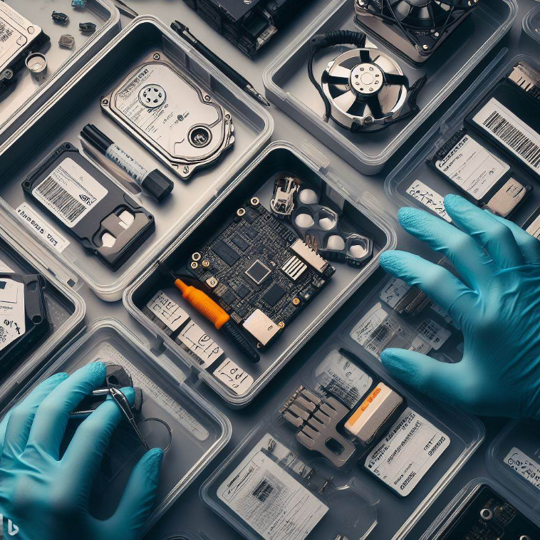
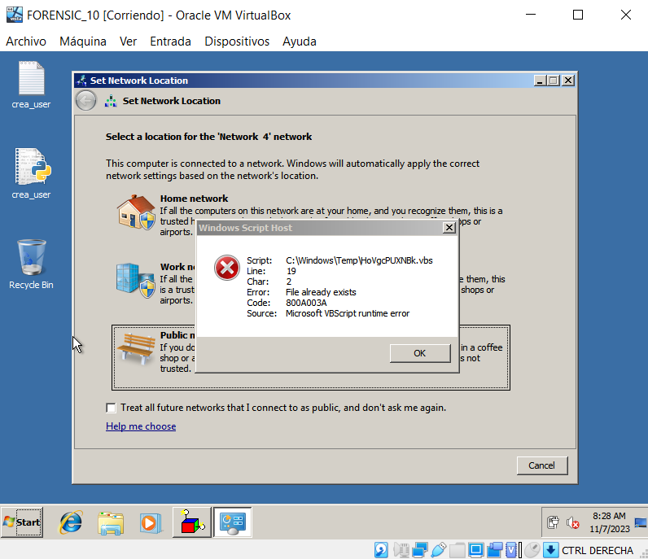
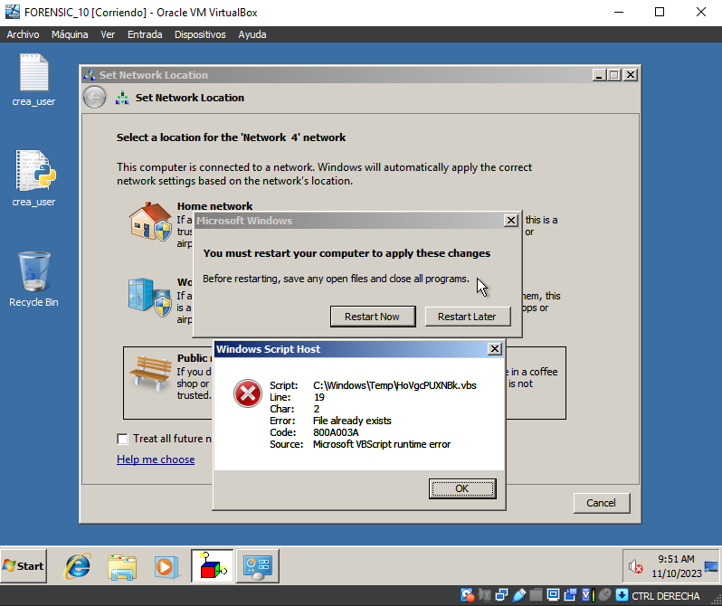
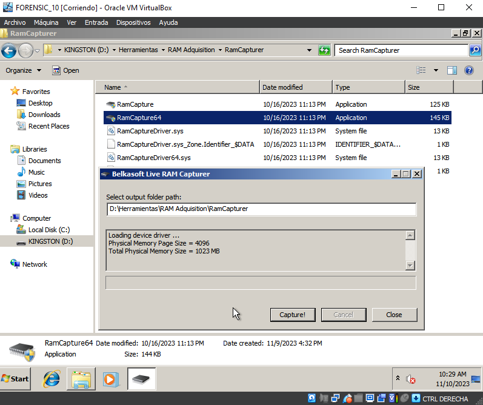
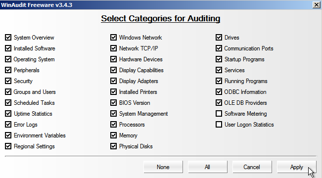
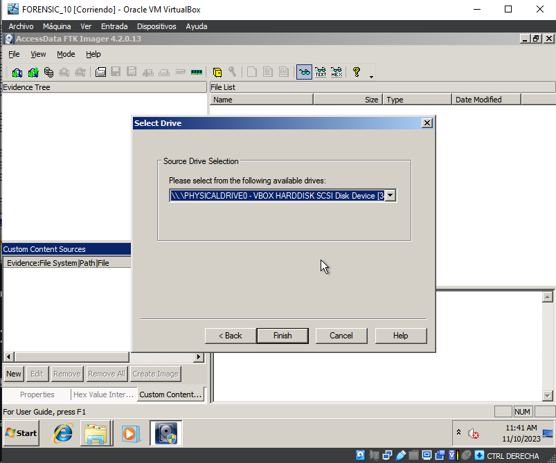
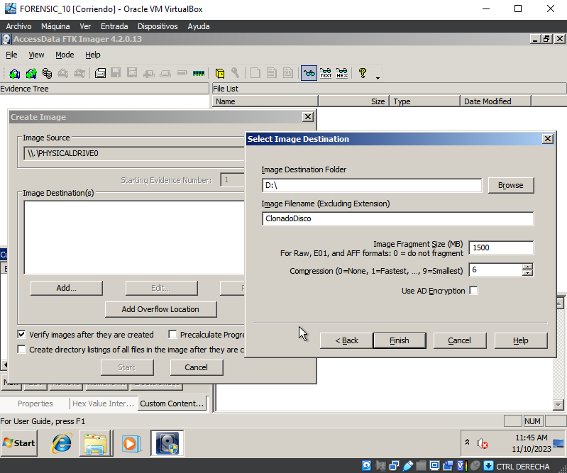

# Parte 1: Recolección y Almacenamiento de Evidencias

Realizado por: Plácido Díaz Garrido

## Índice

1. [**Introducción**](#introducción)
2. [**La Recolección**](#la-recolección)
3. [**La Evidencia**](#la-evidencia)
4. [**Tipo de Evidencia**](#tipo-de-evidencia)
5. [**Orden de Volatilidad**](#orden-de-volatilidad)
6. [**Cadena de Custodia**](#cadena-de-custodia)
7. [**Almacenamiento**](#almacenamiento)
8. [**Metodología Seguida**](#metodología-seguida)

## Introducción
En la ciberseguridad, la recolección y almacenamiento de evidencias son esenciales para investigaciones forenses. Este proyecto sigue la metodología APINAG4, que permite la recolección hasta el almacenamiento seguro. Examinamos tipos de evidencia, el orden de volatilidad y la cadena de custodia, siendo una guía útil para profesionales y entusiastas de la seguridad informática.

## La Recolección
Hemos llevado a cabo la recolección del equipo informático, implementando nuestra norma **APINAG4**. 

### Aislamiento
Hemos realizado un aislamiento de personas no autorizadas en la escena.

### Fotografía de la Escena
Se ha documentado visualmente la escena mediante fotografías (en este caso no podemos colocar imagenes de la escena).

### Registro de la Hora
Hemos obtenido la máquina el viernes, 10 de noviembre de 2023, 08:00.

### Entorno de Trabajo
Estamos operando en una máquina virtual en vivo, manteniendo el equipo encendido sin apagarlo.

## La Evidencia
### Descripción de la Evidencia
En la máquina, se ha identificado un mensaje de error de "Windows Script Host" asociado a un archivo existente en la ruta "C:\Windows\Temp\HoVgcPUXNBk.vbs."

### Imágenes Relevantes

La máquina presenta un mensaje de reinicio, al cual hemos optado por seleccionar "Restart Later."

## Tipo de Evidencia
Tras localizar la evidencia, realizamos un análisis del impacto que esta podría tener.

1. **Potencial Amenaza de Malware o Script Malicioso:** La presencia de un archivo con una extensión mínima en una ubicación temporal es sospechosa y puede indicar la presencia de un script malicioso. La necesidad de reiniciar también sugiere cambios significativos en el sistema.

2. **Riesgo de Pérdida de Datos:** El mensaje de error y la solicitud de reinicio podrían indicar un problema en el sistema que podría resultar en la pérdida de datos o la alteración del funcionamiento normal.

## Orden de Volatilidad

Siguiendo nuestra metodología, se seguirá el orden de volatilidad establecido. Se conectará un pendrive al dispositivo para utilizar las herramientas necesarias.

### Conexión del Pendrive

### Paso 1: Captura de Memoria Volátil

Utilizaremos **RamCapture64** para capturar la memoria volátil.

### Paso 2: Triaje con WinAudit

Se realizará un triaje utilizando la aplicación **WinAudit** con parámetros específicos. La imagen se guardará en una unidad extraíble.

### Paso 3: Copia Completa del Disco con FTK Imager

Realizamos un clonado completo del disco.

Guardamos la copia en un disco duro limpio.

## Cadena de Custodia
La cadena de custodia es esencial en investigaciones forenses para garantizar la integridad de las evidencias digitales. A continuación, se presenta un resumen de la cadena de custodia para el caso número 001, utilizando la metodología APINAG4.

| **Número de Caso:** | 001 |
|---|---|
| **Fecha y Hora de Inicio:** | viernes, 10 de noviembre de 2023, 08:00 |
| **Fecha y Hora de Finalización:** | viernes, 10 de noviembre de 2023, 12:00 |
| **Ubicación:** | Departamento de IT |

### Equipo de Investigación

| **Investigador Principal:** | Plácido Díaz Garrido |
|---|---|
| **Asistentes:** | No hubo |

### Descripción de la Evidencia

- **Fecha y Hora de Obtención:** viernes, 10 de noviembre de 2023, 08:00
- **Descripción de la Evidencia:** Archivo con mensaje de error en "Windows Script Host" y solicitud de reinicio.
- **Ruta de la Evidencia:** "C:\Windows\Temp\HoVgcPUXNBk.vbs"
- **Fotos de la Escena:**

### Procedimientos de Recolección

1. **Aislamiento de la Escena:**
   - Se aseguró la escena para prevenir acceso no autorizado.

2. **Fotografía de la Escena:**
   - Se tomaron fotografías detalladas de la escena.

3. **Registro de la Hora:**
   - Se registró la hora exacta de obtención de la evidencia.

4. **Entorno de Trabajo:**
   - La recolección se realizó en una máquina virtual en vivo.

5. **Captura de Memoria Volátil:**
   - Se utilizó RamCapture64 para capturar la memoria volátil.

6. **Triaje con WinAudit:**
   - Se realizó un triaje utilizando WinAudit con los parámetros específicos.

7. **Copia Completa del Disco:**
   - Se utilizó FTK Imager para realizar una copia completa del disco.

### Almacenamiento de la Evidencia

- **Dispositivo de Almacenamiento:** Samsung 870 QVO 1 TB SATA 2.5
- **Ubicación de Almacenamiento:** Caja fuerte del laboratorio

### Transferencias de Custodia

1. **De la Escena al Laboratorio:**
   - No se transfirió la evidencia del lugar de origen al laboratorio. Se trabajó sobre el equipo ya que este no podía ser transportado.

2. **Entre Investigadores:**
   - La evidencia fué tratada por un solo investigador.

### Acceso a la Evidencia

- **Registro de Acceso:** viernes, 10 de noviembre de 2023, 08:00

### Firmas

| **Investigador Principal:** | Plácido Díaz Garrido |
|---|---|
| **Firma:** | Firmado por Plácido |
| **Fecha:** | 10/11/2023 |

## Almacenamiento
### Dispositivo de Almacenamiento Utilizado
Para garantizar la integridad y seguridad de la evidencia digital recopilada, hemos seleccionado un dispositivo de almacenamiento confiable: **Samsung 870 QVO 1 TB SATA 2.5**. Este dispositivo ofrece una capacidad suficiente para contener la información recopilada durante la investigación, y su formato SATA 2.5 garantiza compatibilidad con una amplia gama de sistemas.

### Ubicación Segura: Caja Fuerte del Laboratorio
La evidencia se almacena en una caja fuerte ubicada en nuestro laboratorio forense. La elección de una caja fuerte proporciona una capa adicional de seguridad física para proteger la integridad de la información recolectada. Este enfoque es crucial para evitar el acceso no autorizado y preservar la cadena de custodia.

### Acceso a la Evidencia
El acceso a la evidencia está estrictamente controlado y registrado. Solo el investigador principal, en este caso, Plácido Díaz Garrido, tiene acceso autorizado. Cada vez que se accede al dispositivo de almacenamiento, se registra la fecha y la hora correspondientes.

## Metodología Seguida
Hemos seguido la norma APINAG4, que proporciona un marco sólido para investigaciones forenses informáticas. La metodología aborda diferentes aspectos, incluyendo el proceso de recolección en equipos informáticos, dispositivos móviles, orden de volatilidad, procedimientos de análisis, almacenamiento, herramientas y consideraciones legales.
